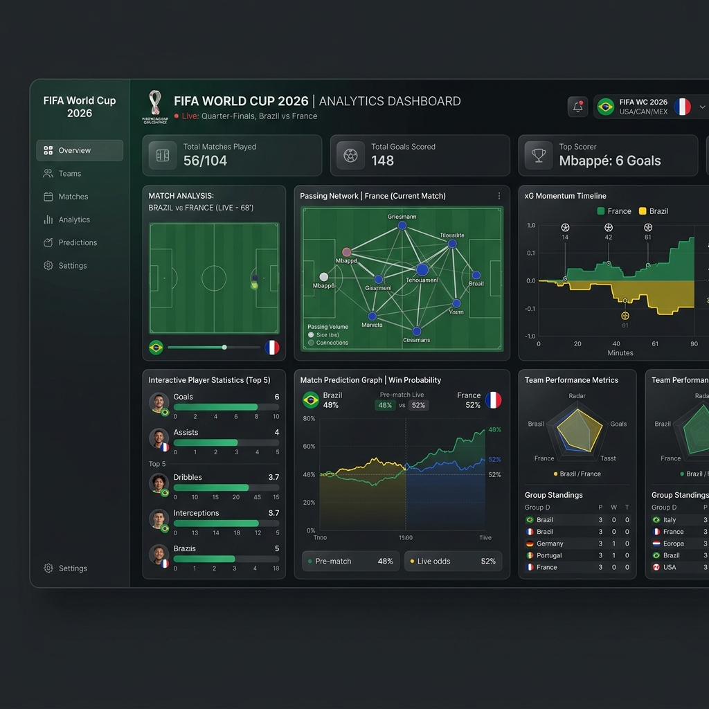

<p align="center">
  
</p>

<h1 align="center">FIFA World Cup 2026 Analytics Dashboard</h1>

An interactive web analytics dashboard for monitoring, forecasting, and reviewing matches in the FIFA World Cup 2026.

The dashboard integrates live tournament APIs, curated per-match baseline JSON,
cache-backed World Football Elo rating inputs, Elo-derived forecasting, and
historical BigQuery/StatsBomb proxy visualizations into a responsive
React/FastAPI application. Source-backed AI matchday research is implemented as
draft collector/briefing artifacts under the approved T-035 source policy.

**Live Dashboard:** [https://accionar.xyz/dashboards/fifa-2026/](https://accionar.xyz/dashboards/fifa-2026/)

## Key Features

- **Tournament Board & Painters-Tape Bracket**: Fully interactive knockout stage bracket rendering real-time results directly from the tournament API, alongside live Group Stage standings sorted dynamically by points, goal difference, and goals scored.
- **Match of the Day Tactical Previews**: Static curated baseline summaries (headlines, formations, systems, injuries, and 3 match-specific insights) for active local fixture folders.
- **Mathematical Forecaster**: Elo-derived Poisson forecast with Dixon-Coles low-score adjustment, using cache-backed World Football Elo rating inputs where available and explicit default fallback handling where missing.
- **Tournament Progression Simulation**: Seeded random-trial Monte Carlo tournament simulation with 10,000 default trials, source metadata, and neutral fallback handling where a team rating is unavailable.
- **Squad Style & Metric Comparison**: Visualizes team-by-team tactical KPIs with per-value provenance badges. Source-backed fields are merged at runtime from an audited source cache (T-038); unsupported or unavailable fields render as explicit missing/reference states rather than invented values.
- **Bespoke Visualizations**: Renders historical StatsBomb proxy plots including xG distribution comparisons, passing networks, shot maps, touch heatmaps, and progressive action maps using `mplsoccer`.
- **Last-Minute Briefing Pipeline**: `briefing.json` matchday artifacts are generated separately from baseline previews, with source/freshness validation and blocked states for incomplete data. The dedicated `GET /api/match/{id}/briefing` endpoint (T-033) returns safe baseline, stale, invalid, and source-backed states, and Match Analysis renders a freshness badge. Source-backed research collection exists as draft `research_cache.json` output.
- **Spanish Translation Toggle**: Seamless switcher at the top of the Match Analysis panel to translate labels and Match Analysis content between English and Español.

## Running Locally

The current app is React/Vite plus FastAPI. Run the frontend and backend in
separate terminals during development:

```bash
# Install Python dependencies
pip install -r requirements.txt

# Install frontend dependencies
npm --prefix src/frontend install

# Terminal 1: run API
uvicorn src.api.main:app --host 0.0.0.0 --port 8080 --reload

# Terminal 2: run frontend
npm --prefix src/frontend run dev
```

Local verification:

```bash
python3 -m compileall -q src && npm --prefix src/frontend run build
```

`src/app/` contains legacy Streamlit reference code. It is not the canonical
runtime unless a future decision restores it.

## Compilation & Pipeline

The static data preview files are compiled using the pipeline script:

```bash
python src/pipeline/generate_match_previews.py
```

Current caution: this script can overwrite curated `summary.json` files.
Baseline previews and last-minute match briefings are separate concepts. The
matchday briefing artifact is `data/matches/{match_id}/briefing.json`, generated
by:

```bash
python3 src/pipeline/generate_match_briefings.py --dry-run --window-hours 3
```

See `docs/last_minute_briefing_plan.md` before changing generation behavior.

Refresh no-cost national-team ratings through the audited cache collector:

```bash
python3 src/pipeline/collect_rating_sources.py --write
```

For tournament progression, missing fixture folders should be created through
`src/pipeline/discover_active_fixtures.py`, not by manually copying old match
folders.

Model and source-provenance truth is documented in
`docs/model_provenance.md`. Do not describe hardcoded defaults, deterministic
formulas, or historical proxies as live, scraped, simulated, or fully
AI-researched data.

The approved source policy for future online research is documented in
`docs/ai_research_source_policy.md`.
